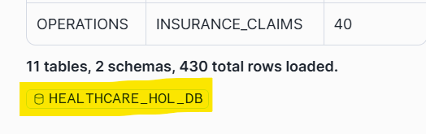

# Healthcare -- Cortex Code HOL

## Powered by Cortex Code

---

### About This Lab

In this hands-on lab, you will build a fully functional AI-powered Healthcare Intelligence using **only natural language prompts** in Snowflake's AI-powered development platform, **Cortex Code**. No SQL writing, no YAML editing, no manual UI configuration -- you'll talk to Cortex Code and it will build everything for you.

**What you'll build:**

1. **Clinical Database** -- Patient records, encounters, lab results, and more
2. **Cortex Analyst** -- Ask questions in plain English, get SQL results instantly
3. **Cortex Search** -- Natural language search across clinical PDFs and reports
4. **Intelligence Agent** -- AI orchestrator that routes queries to the right tool automatically
5. **Streamlit App** -- Chat interface, live dashboards, and bed optimization

**Time:** 75 minutes hands-on
**Prerequisites:** A laptop with a modern browser. No coding experience required. No files to download -- everything comes directly from GitHub.

---


---

## Step 0: Get Started (8 minutes)

### 0.1 Create and Log Into Your Snowflake Trial Account

A shared URL will be provided to sign up for a Snowflake trial account.

1. Navigate to the **signup URL** provided by your instructor
2. Ensure **"AI Data Cloud for Enterprise"** is selected (see screenshot below)
3. Select **AWS** as the cloud provider and **US East (Virginia)** as the region
4. Fill out the registration form with your details
4. Click **Continue** and complete the signup process
5. Check your email for a confirmation from Snowflake
6. Follow the instructions in the email to activate your account and set your password
7. Log in to your new Snowflake trial account — you should land on the **Snowsight** home page


### 0.2 Open Cortex Code

1. Look for the **Cortex Code icon** in the **lower-right corner** of Snowsight (see screenshot below)
2. Click it -- the Cortex Code panel will open on the right side of the screen
3. You should see a chat input box at the bottom of the panel


> **What is Cortex Code?** Cortex Code is Snowflake's AI-powered development platform. You can ask it to write SQL, create objects, build applications, and more -- all through natural language conversation. Think of it as your AI pair programmer that understands Snowflake natively.

### 0.3 Connect to the Lab's GitHub Repository

Instead of downloading any files, you'll connect Snowflake directly to the public GitHub repository that contains all the lab materials. Snowflake can read and execute files straight from GitHub -- no ZIP files, no uploads.

Copy and paste this prompt into Cortex Code:

```
Please connect my Snowflake account to a public GitHub repository so I can
use it as a file source during this lab.

1. Create a database called HOL_UTILS with schema PUBLIC if it doesn't exist
2. Create an API integration called HOL_GITHUB_API for GitHub HTTPS access,
   allowing the prefix https://github.com/jfromkamel/
3. Create a Git repository object called SNOWFLAKE_AI_HOL_REPO in the
   HOL_UTILS.PUBLIC schema pointing to:
   https://github.com/jfromkamel/snowflake-ai-hol
4. Fetch the latest contents from the repository
5. Confirm everything worked by listing the top-level files and folders
   available in the main branch
```

> **What's happening:** Cortex Code is creating a live connection between your Snowflake account and the lab's GitHub repository. All scripts, models, and documents will be accessible directly from GitHub -- no manual file handling needed.

> **Important -- "Allow in this chat" (or "Allow in this session") permissions:** When Cortex Code tries to run a CREATE statement, you'll see a permission prompt asking whether to allow it. Click the **Allow** dropdown arrow and select **"Allow CREATE in this chat"** (or **"Allow CREATE in this session"**). Do the same for any subsequent permission prompts you encounter (e.g., ALTER, INSERT, etc.). This prevents you from having to manually approve every single statement for the rest of the lab.
>
> 

**Expected output:** In the Cortex Code response, you should see a folder listing including `healthcare/`, `financial-services/`, `industrial/`, and `README.md`.

> **Note:** This is the only prompt in the lab that requires ACCOUNTADMIN. Cortex Code will handle the role switching automatically.

> **Troubleshooting:** If Cortex Code can't handle the Git setup, see **Appendix A: Fallbacks** at the end of this guide.

### 0.4 Browse Lab Files in a Workspace

Now that Snowflake is connected to GitHub, create a visual workspace to browse the repo files:

1. In the left sidebar, go to **Projects > Workspaces**
2. Click the **+** next to Databases and select **Git workspace**
3. Paste: `https://github.com/jfromkamel/snowflake-ai-hol`
4. Select `HOL_GITHUB_API` as the API Integration
5. Choose **Public repository** for authentication
6. Click **Create**


**Expected output:** The repo files (`healthcare/`, `financial-services/`, `README.md`) appear in the left-hand file explorer. You can browse any file directly from Snowsight.

> **Why this matters:** Your Snowflake account now has a live, bidirectional connection to GitHub. You can pull the latest changes, create branches, commit edits, push updates back to the remote repo, and resolve merge conflicts -- all directly from Snowsight. This means developers get full Git workflows (branching, pull/push, conflict resolution) natively inside Snowflake without switching tools.

> **Tip:** Feel free to browse the files freely in the workspace file explorer -- you'll find setup scripts, PDF documents, and prompt libraries for each industry track.


---

## Step 1: Build the Database and Load Data (10 minutes)

In this step, you'll create a healthcare database with patient records, encounters, diagnoses, lab results, and more -- all by asking Cortex Code to run a single script directly from GitHub.

### 1.1 Execute the Setup Script

Copy and paste this prompt into Cortex Code:

```
Please execute the setup script from the GitHub repository we connected.
Run this file to create the healthcare database, warehouse, all tables,
internal stages, and load all sample data:

@HOL_UTILS.PUBLIC.SNOWFLAKE_AI_HOL_REPO/branches/main/healthcare/scripts/setup.sql

Use EXECUTE IMMEDIATE FROM to run it. After execution, set
HEALTHCARE_HOL_WH as the active warehouse for the rest of our session
and show me a summary table of every table created with its schema and
row count so I can confirm everything loaded correctly.

Include a pill at the end of the response that redirects to the created database.
```

> **What's happening:** Cortex Code is pulling the setup script directly from GitHub and executing it. The script creates:
> - Database: `HEALTHCARE_HOL_DB` with schemas `CLINICAL` and `OPERATIONS`
> - Warehouse: `HEALTHCARE_HOL_WH`
> - 11 tables with realistic patient, provider, and operational data
> - Internal stages for files you'll use later

> **Congratulations!** You just built an entire database without writing a single line of SQL.

### 1.2 Explore Your New Database

Take a moment to see what was created. In the Cortex Code response, you'll see a hyperlink to **HEALTHCARE_HOL_DB** — click it to open the database directly in the Database Explorer. From there, expand **CLINICAL > Tables** and click on any table (e.g., **BEDS**) to see its details, columns, and a Cortex-generated description that automatically explains what the table contains.

&nbsp;



&nbsp;

> **Tip:** If Cortex Code didn't provide a hyperlink to the database in the response, you can navigate to it manually through the **Database Explorer** menu in the left sidebar. From there, expand **HEALTHCARE_HOL_DB > CLINICAL > BEDS**. See **Appendix A: Fallbacks** at the end of this guide for a screenshot.

&nbsp;


> **Why this matters:** The Database Explorer gives you instant visibility into every object Cortex Code created -- table schemas, row counts, column types, and AI-generated descriptions -- without writing a single query.

---

## Step 2: Create the Semantic Layer (12 minutes)

Cortex Analyst is Snowflake's text-to-SQL engine. You define your business metrics, table relationships, and business rules once -- then anyone can query your data in plain English without knowing SQL.

In this step, you'll have Cortex Code **set up Cortex Analyst** from scratch.

### 2.1 Create a Cortex Analyst Semantic View for Clinical Data

This is the "wow" moment. Copy and paste this prompt into Cortex Code:

```
Create a Cortex Analyst semantic view for the clinical data in
HEALTHCARE_HOL_DB.CLINICAL.

Include these tables: PATIENTS, PROVIDERS, DEPARTMENTS, ENCOUNTERS,
DIAGNOSES, PROCEDURES, MEDICATIONS, LAB_RESULTS, BEDS, and READMISSIONS.

Business intelligence rules:
- Flag "high readmission risk" when RISK_SCORE > 0.7
- Flag "extended stay" when LENGTH_OF_STAY > 7
- Flag "critical lab" when RESULT_FLAG = 'Critical'

Make sure it can answer questions like:
1. "How many patients are currently admitted?"
2. "What is the average length of stay by department?"
3. "Which patients are at high risk for readmission?"
4. "Show me all critical lab results"

Name it PATIENT_CARE and store it in HEALTHCARE_HOL_DB.CLINICAL.
Register it directly as a semantic view without saving any intermediate
files to a stage.
```

> **What's happening:** Cortex Code is analyzing your table structures, understanding the clinical relationships, and configuring a complete text-to-SQL layer. This would normally take a data engineer hours to write manually.

### 2.2 Create a Cortex Analyst Semantic View for Claims Analytics

Copy and paste this prompt into Cortex Code:

```
Create a Cortex Analyst semantic view for insurance claims analytics.

Include these tables:
- HEALTHCARE_HOL_DB.OPERATIONS.INSURANCE_CLAIMS
- HEALTHCARE_HOL_DB.CLINICAL.PATIENTS
- HEALTHCARE_HOL_DB.CLINICAL.ENCOUNTERS

Join INSURANCE_CLAIMS to PATIENTS on PATIENT_ID, and to ENCOUNTERS
on ENCOUNTER_ID.

Business intelligence rules:
- Flag "claim denied" when STATUS = 'Denied'
- Calculate approval rate as percentage of claims with STATUS = 'Approved'
- Calculate average reimbursement as APPROVED_AMOUNT / CLAIM_AMOUNT

Make sure it can answer questions like:
1. "What is the total claim amount by insurance type?"
2. "Which claims were denied?"
3. "What is the approval rate by department?"
4. "Show average reimbursement percentage by insurance type"

Name it CLAIMS_ANALYTICS and store it in HEALTHCARE_HOL_DB.CLINICAL.
Register it directly as a semantic view without saving any intermediate
files to a stage.
```

### 2.3 Explore Your Semantic Model in Snowsight

Step out of Cortex Code for a moment -- let's see what you built in the Snowsight UI.

**Navigate to the Analyst:**

1. In the left navigation, hover over the **Cortex** icon (or **AI/ML** section)
2. Click **Analyst**
3. In the **Database** dropdown at the top, select **HEALTHCARE_HOL_DB**, then select the **CLINICAL** schema
4. Find your **PATIENT_CARE** semantic view in the list and click it to open it

**Ask a question:**

5. Click the **Playground** tab on the right-hand side to open the chat interface
6. In the chat box, type: *"How many patients are currently admitted by department?"*
7. Cortex Analyst generates SQL, runs it, and returns results -- all in one step
8. Click **Add to Verified Queries** below the response to save this as a verified query. Verified queries act as trusted reference answers that improve the model's accuracy over time.

**Explore your semantic view:**

9. Click the **Suggestions** tab and then click **Start Learning** to let the model analyze your data. While it learns, explore the other tabs:
   - **Custom Instructions** -- business rules and context you provided (e.g., "high readmission risk = RISK_SCORE > 0.7")
   - **Logical Tables** -- the tables included in this model and their columns
   - **Relationships** -- how tables are joined together
   - **Verified Queries** -- saved question/SQL pairs (including the one you just added) that serve as reference examples
   - **Monitor** -- a history of every question asked, the SQL generated, whether it succeeded, and user feedback

> **Note:** The Analyst can answer *any* natural language question about the included tables -- not just verified ones. Verified queries simply improve accuracy by giving the model reference examples of correct SQL for common questions.

**Ask a follow-up:**

10. Go back to the **Playground** tab and ask: *"What is the average length of stay for cardiology patients?"*
11. Notice the conversation maintains context -- this is a full dialogue, not isolated one-off queries.
12. Return to the **Suggestions** tab -- check if the model has generated any suggestions for improving your semantic view's coverage.

> **Key takeaway:** Anyone in your organization -- a nurse manager, a CMO, an ops analyst -- can now query clinical data in plain English. No SQL, no data engineering ticket, no waiting.

---

## Step 3: Set Up Document Search (8 minutes)

So far, your agent can answer any question about clinical operations, triage protocols, discharge procedures, and readmission policies that lives in structured tables. But a lot of critical knowledge lives somewhere else entirely -- in documents.

When a clinician asks your agent "What is our discharge planning procedure for high-risk patients?", the answer isn't in a database table -- it's in your Clinical Operations Manual. That's the gap Cortex Search fills.

In this step, you'll turn a PDF document into a fully searchable knowledge base. Cortex Search automatically reads the document, breaks it into meaningful sections, and builds a semantic index so the agent can retrieve the right passage for any question -- even when the exact words don't match.

This is what's commonly called **RAG (Retrieval Augmented Generation)** -- but you won't need to configure any of that. Cortex Code handles it in one prompt.

### 3.1 Bring the PDF into Snowflake

> **Before continuing:** Click the **Snowflake logo** in the upper-left corner to return to the homepage. If the Cortex Code chat panel is closed, expand it from the lower-right corner.

Copy and paste this prompt into Cortex Code:

```
Bring the following PDF from our GitHub repository into
HEALTHCARE_HOL_DB.CLINICAL so we can make it searchable:

@HOL_UTILS.PUBLIC.SNOWFLAKE_AI_HOL_REPO/branches/main/healthcare/pdfs/Clinical Operations Manual.pdf
```

### 3.2 Create the Search Service

Copy and paste this prompt into Cortex Code:

```
Create a Cortex Search service called CLINICAL_DOCS_INFO in
HEALTHCARE_HOL_DB.CLINICAL that makes the clinical operations PDF
searchable with natural language.

To do this:
- Temporarily scale up HEALTHCARE_HOL_WH for processing power
- Read and parse the PDF content
- Break it into overlapping chunks for better search accuracy
- Index everything so it can be queried in plain English
- Scale the warehouse back down to SMALL when done
```

### 3.3 Preview the Document and Explore the Search Service

**First, preview the source PDF:**

Before testing search, let's confirm the document loaded correctly and give you a chance to review it. Paste this prompt into Cortex Code:

```
Generate a presigned URL so I can preview the file "Clinical Operations Manual.pdf" in
HEALTHCARE_HOL_DB.CLINICAL.PDF_STAGE -- use an expiry of 3600 seconds.
```

Cortex Code will return a URL. Open it in a new browser tab to read the source document your search service is built on.

> **Why this matters:** Seeing the source document helps you understand why the search returns what it returns. You're not searching a black box -- the content is fully visible and auditable.

**Navigate to the Search Playground:**

1. In the left navigation, hover over the **Cortex** icon (or **AI/ML** section)
2. Click **Cortex Search**
3. In the **Database** dropdown, select **HEALTHCARE_HOL_DB** (might already be pre-selected)
4. Find **CLINICAL_DOCS_INFO** in the list and click on it to open it
5. You'll land on the service detail page -- click the **Query** tab (or **Playground**) to open the search interface

**Run a search:**
6. In the search box, type: *"discharge planning procedures"*
7. Review the results -- notice it returns the most relevant passages from the document, not just keyword matches
8. Click into a result to see the full chunk of text it retrieved

**Try a semantic search (the real power):**
9. Now type: *"triage protocol for chest pain"*
10. Try rephrasing the same concept in different words -- notice the results stay relevant even when your wording doesn't exactly match the document

> **What you're seeing:** This is hybrid search -- combining keyword matching with semantic (meaning-based) matching. It finds the right passage even when someone asks a question differently than the document is written.


> **Key takeaway:** Your agent can now answer policy questions like "What is the readmission prevention protocol for heart failure patients?" -- grounded in your actual documentation, not hallucinated.

---

## Step 4: Build the Intelligence Agent (10 minutes)

Now you'll wire everything together into a single AI agent that automatically routes questions to the right data source.

### 4.1 Create the Agent

Copy and paste this prompt into Cortex Code:

```
Create a Snowflake Intelligence Agent named HEALTHCARE_AGENT in
HEALTHCARE_HOL_DB.CLINICAL.

Give it three tools:

1. A data analysis tool named PATIENT_CARE_DATA connected to the
   PATIENT_CARE semantic model in HEALTHCARE_HOL_DB.CLINICAL.
   It answers questions about patients, encounters, diagnoses,
   labs, and bed management. Use HEALTHCARE_HOL_WH.

2. A data analysis tool named CLAIMS_DATA connected to the
   CLAIMS_ANALYTICS semantic model in HEALTHCARE_HOL_DB.CLINICAL.
   It analyzes insurance claims, approval rates, and billing data.
   Use HEALTHCARE_HOL_WH.

3. A document search tool named CLINICAL_DOCS connected to the
   CLINICAL_DOCS_INFO search service in HEALTHCARE_HOL_DB.CLINICAL.
   It searches clinical documentation for protocols and procedures.
```

### 4.2 Explore the Two UIs

There are two separate places in Snowsight where your agent lives -- and they serve completely different audiences.

---

**View 1: Cortex > Agents (the admin view)**

This is where developers and data engineers build and manage agents. Think of it as the control panel.

1. In the left navigation, hover over the **Cortex** icon (or **AI/ML** section)
2. Click **Agents**
3. Find **HEALTHCARE_AGENT** and click on it
4. On the left-hand side, you'll see all 3 tools listed:
   - PATIENT_CARE_DATA (Cortex Analyst -- clinical data)
   - CLAIMS_DATA (Cortex Analyst -- insurance claims)
   - CLINICAL_DOCS (Cortex Search -- documentation)
5. Ask a couple of questions in the chat panel, for example: *"Which patients are at high risk for readmission?"* and *"What is the discharge planning procedure?"*
6. Open the **Monitor** tab and click on a specific request to see all monitoring metrics -- latency, tokens used, tool calls made, and the full response trace

> **Who uses this view:** Admins and data engineers. This is where you build, update, and govern agents. Business users never need to come here.

---

**View 2: Snowflake Intelligence (the end-user experience)**

This is what your business users actually see -- a polished, conversational interface built on top of the same agent.

7. Click **Preview in Snowflake Intelligence** in the upper-right corner to switch from the admin view to the end-user experience

**What's different here compared to Cortex > Agents:**
- Responses automatically render as **charts or tables** depending on the question type -- no configuration needed
- Citations appear below answers, linking back to the exact data source or document passage
- Conversations are **threaded** -- users can continue a conversation, branch off, or start fresh
- Users can **upload files** (CSV, PDF, XLSX) directly in the chat to add context to their questions
- There is an **Extended Thinking** toggle for complex, multi-step analytical questions

> **Why this matters:** The agent you built in Cortex Code is the engine. Snowflake Intelligence is the car. Business users interact with the car -- they never need to know what's under the hood.

---

### 4.3 Test the Agent in Snowflake Intelligence

Try these questions to see the three types of responses:

**Question 1 -- Structured data (table response):**
> Which patients are at high risk for readmission?

**Question 2 -- Charting (visual response):**
> Plot the number of admissions by department over the last 30 days as a line chart.

**Question 3 -- Unstructured data (document search):**
> What does our documentation say about discharge planning procedures?

---

## Step 5: Build a Streamlit App (25 minutes)

You've already built something powerful: an agent accessible through Snowflake Intelligence with conversational AI, auto-generated charts, threaded conversations, and citations. So what does a Streamlit app add on top of that?

Think about a nurse manager who needs a real-time view of bed occupancy and patient risk flags -- in a layout designed for clinical rounds, not open-ended questions. That's a different kind of experience -- a purpose-built application with a fixed layout, specific operational views, and embedded computation like the optimization engine you'll build in this step.

The agent you've created is actually surfaceable in three different ways, and they complement each other:

| | Snowflake Intelligence | Streamlit in Snowflake | Cortex Agents REST API |
|--|--|--|--|
| **Best for** | Open-ended exploration and self-service analytics | Structured operational apps with fixed layouts and custom tools | Embedding the agent anywhere outside Snowflake |
| **Experience** | Conversational with auto-charting, threading, and citations | Multi-page app with dashboards, forms, and Python computation | Any interface you build -- chat widgets, portals, integrations |
| **Customization** | Agent behavior and instructions | Full control over UI, layout, branding, and logic | Full control -- wire the agent into Slack, Teams, web apps, or mobile |
| **Computation** | Answers and analysis from your data | Python on top of live data -- optimization, ML, file processing | Depends on the client you build |

> **The Cortex Agents REST API** is the same endpoint this Streamlit app will call. That means the agent you built today can also power a Slack bot, a Microsoft Teams integration, an external web portal, or a mobile app -- with no changes to the agent itself.

In this step, you'll build a 3-page app:
1. **Chat** -- the same agent, now inside your own branded interface
2. **Dashboard** -- fixed operational views of bed occupancy by department, critical lab alerts, and high-risk patient flags
3. **Optimization** -- a bed allocation optimizer built in Python that runs directly on your live data

> **The big picture:** Snowflake Intelligence is a great out-of-the-box experience. Streamlit is how you build a product around the same intelligence layer -- and the REST API is how you take it everywhere else.

### 5.1 Create the Chat Page (8 minutes)

> **Before continuing:** Switch back to your original browser tab (Snowflake Intelligence opened in a new tab). Navigate to **Projects > Workspaces** and open your workspace. Make sure Cortex Code is open in the lower-right corner.

Copy and paste this prompt into Cortex Code:

```
Build a single-page Streamlit app in Snowflake called HEALTHCARE_ASSISTANT_APP
in HEALTHCARE_HOL_DB.CLINICAL using HEALTHCARE_HOL_WH.

Use my workspace to create the Streamlit files directly for collaboration.
Use streamlit==1.52.2 for chat features.

Use st.tabs() to create a horizontal tab bar at the top of the page
with three tabs: "Chat", "Dashboard", and "Optimization". All three
tabs should be visible and switchable at the top -- no sidebar page
navigation.

Start with the Chat tab:
- A sidebar with the title "Healthcare Intelligence" and a brief description of the app
- A chat interface where users can have a conversation with HEALTHCARE_AGENT
- Show the agent's responses in the chat as they arrive
- When the agent returns data, display it as a table below the response
- When the agent returns SQL, show it in a collapsible section
- Keep the conversation history visible throughout the session

Apply a clean clinical design throughout the app:
- Main content background: white (#FFFFFF) with light gray panels (#F1F5F9)
  and subtle drop shadows on cards -- the surface should feel clean and open
- Sidebar: slate blue (#334155) with white text and a teal left border on the
  active page -- provides clear navigation contrast without being harsh
- Primary color: soft blue (#2563EB) for headings, buttons, and active states;
  teal (#0D9488) as a secondary accent
- Typography: sentence case throughout -- no all-caps; use medium weight for
  section headers and regular weight for body text
- Alerts and critical values: green (#16A34A) for healthy/normal, amber
  (#D97706) for warnings, red (#DC2626) for critical -- used sparingly
- Data tables: white background, alternating light gray rows (#F8FAFC),
  status pills (small colored badges) rather than full-row highlights
- KPI cards: white background, rounded corners, thin colored left border
  indicating status, large bold number in dark slate (#1E293B)
- Charts: white background with the soft blue as the primary series color
- Chat input area: white background matching the main content -- seamlessly
  part of the page, not a floating element
- Overall feel: a clinical operations dashboard -- precise, trustworthy, and
  easy to read at a glance during rounds or a hospital staff review

```

### 5.2 Open and Test the Chat Page

1. In the left sidebar, go to **Projects > Streamlit**, right-click **HEALTHCARE_ASSISTANT_APP**, and select **Open in new tab**
2. Keep this tab open for the rest of the lab -- use it to view and refresh the app whenever changes are made. Use your other tab (with the workspace and Cortex Code) for prompting.

> **App not loading or showing an error?** Copy the full error message, go back to Cortex Code, and paste this prompt:
>
> \> My Streamlit app is showing the following error. Please read the app code,
> identify the cause, and fix it:
>
> [paste your error here]
> \>
> Cortex Code will read the app files, diagnose the issue, and update the code. Refresh the app once it confirms the fix.

> **Visual design issues?** Cortex Code supports images -- take a screenshot of the problem, go back to Cortex Code, paste the screenshot directly into the chat, and use this prompt:
>
> ```
> Here is a screenshot of my Streamlit app showing a visual issue.
> Please read the app code, identify what is causing it, and fix it.
> ```
>
> Cortex Code will read the screenshot, diagnose the layout or styling problem, and update the code. Refresh the app once it confirms the fix.

2. Try asking: **"Which patients are currently admitted to the ICU?"**
3. Watch the agent respond through your app!

### 5.3 Add the Dashboard Tab (10 minutes)

Copy and paste this prompt into Cortex Code:

```
Fill in the Dashboard tab of HEALTHCARE_ASSISTANT_APP with the following content.

This page should show live data from HEALTHCARE_HOL_DB.CLINICAL:

TOP ROW - four summary numbers:
- Total Admitted Patients (PATIENTS where STATUS = 'Admitted')
- Bed Occupancy Rate (occupied beds / total beds as percentage)
- Average Length of Stay (from ENCOUNTERS)
- High Readmission Risk Patients (READMISSIONS where RISK_SCORE > 0.7)

MIDDLE ROW - two charts side by side:
- A bar chart of bed occupancy by department, highlighting departments
  above 80% occupancy
- A pie chart of encounters by type (Inpatient/Outpatient/Emergency)

BOTTOM ROW - a critical alerts table:
- All patients with RISK_SCORE > 0.7, showing: Patient Name,
  Department, Primary Diagnosis, Risk Score, Days Since Last Discharge,
  Readmission Reason
- Sort by risk score descending (highest risk first)
- Include a button to download the table as a CSV

INTERACTIVITY:
- Add a department filter dropdown at the top that filters all charts and the table
- Add a risk score slider to adjust the threshold (default 0.7)
- Make the bar chart bars clickable -- clicking a department filters the patient table to show only that department's high-risk patients

Chart styling:
Use plotly for all charts. Color palette: steel blue (#2563EB) as the primary series color, teal (#0D9488) as the secondary. Use green (#16A34A), amber (#D97706), red (#DC2626) for status-based coloring only. All chart backgrounds should be white (#FFFFFF) with light gray grid lines. No dark backgrounds on any chart.
Position the legend below each chart (orientation="h", y=-0.3) to prevent overlap with chart titles. Add a top margin (t=50) on all charts so the title never crowds the plot area.
```

### 5.4 Add the Optimization Tab (7 minutes)

Copy and paste this prompt into Cortex Code:

```
Fill in the Optimization tab of HEALTHCARE_ASSISTANT_APP with the following content.

Title: "Clinical Intelligence"
Subtitle: "Optimize bed allocation and forecast patient demand using
AI and machine learning on your live clinical data."

At the top of the tab, add a mode selector using radio buttons:
- "Bed Optimizer"
- "Demand Forecaster"

---

MODE 1: Bed Optimizer

DATA EXPLORATION (shown immediately when this mode is selected):
- A department multi-select filter (from DEPARTMENTS table, plus "All")
- A slider for Occupancy Alert Threshold: 60% to 95% (default 80%)
- A plotly grouped bar chart showing current occupancy by department
  (occupied vs available beds), with a horizontal reference line at the
  threshold -- updates in real-time as filters change
- Below the chart, a data table showing current bed status per department
  (Department, Occupied, Available, Occupancy %, Status)

OPTIMIZATION CONTROLS (below the data exploration):
- A toggle: "Include patients nearing discharge (LOS > 5 days)"
- A steel blue "Run Optimizer" button

When clicked:
1. Pulls current bed status from BEDS and department occupancy from ENCOUNTERS
2. Finds departments above the selected occupancy threshold
3. If the discharge toggle is on, flags patients with LENGTH_OF_STAY > 5 as
   near-discharge candidates
4. Uses linear programming (scipy) to suggest moves that balance occupancy
   while keeping patients in the correct bed type (ICU stays ICU, Pediatric
   stays Pediatric, etc.)

Display results as:
- Three KPI cards: Departments Over Threshold, Beds That Can Be Freed,
  Patients Flagged for Discharge Review
- A plotly grouped bar chart showing before/after occupancy by department,
  with the threshold reference line
- A recommended actions table: Patient ID, From Department, To Department,
  Bed Type, Reason -- sorted by urgency
- A button to download recommendations as CSV

---

MODE 2: Demand Forecaster

DATA EXPLORATION (shown immediately when this mode is selected):
- A department dropdown (from DEPARTMENTS table)
- A date range slider to explore historical data (last 90 days)
- A plotly line chart showing historical daily admissions and occupancy
  from DAILY_CENSUS for the selected department, updating as filters
  change. Use soft blue for admissions, teal for occupancy count.
- Below the chart, a summary table of the filtered census data
  (Date, Admissions, Discharges, Occupancy, Available Beds)

FORECASTING CONTROLS (below the data exploration):
- Radio buttons for Forecast Horizon: 7 days / 14 days / 30 days
- A steel blue "Generate Forecast" button

When clicked:
1. Pull daily census data from DAILY_CENSUS for the selected department
2. Use SNOWFLAKE.ML.FORECAST to train a forecast model on the historical
   ADMISSIONS values and predict the next N days (based on the selected
   horizon). Run this as a SQL operation inside Snowflake.
3. Retrieve forecast values with upper and lower confidence bounds

Display results as:
- A headline KPI card: "Forecasted Daily Admissions" (average over the
  forecast horizon)
- A plotly line chart combining historical and forecast:
  - Historical admissions (solid blue line, #2563EB)
  - Forecasted admissions (dotted line with light blue confidence band)
  - Capacity threshold line (dashed red at available beds)
  - X-axis: dates, Y-axis: patient count
  - Legend below the chart, white background
- A capacity risk table: dates where forecasted admissions + current
  occupancy would exceed available beds, with columns:
  Date, Forecasted Admissions, Projected Occupancy, Capacity, Risk Level
- A button to download the forecast as CSV

---

Apply the same styling as the rest of the app throughout:
white background, soft blue primary (#2563EB), teal accent (#0D9488),
plotly white chart backgrounds, sentence case, no all-caps.

Add scipy to the app's dependencies.
```

### 5.5 Test Your Complete App

1. **Chat** -- Ask "What are the most common diagnoses this month?"
2. **Dashboard** -- Review occupancy rates and readmission risk alerts
3. **Optimization** -- Click "Run Optimization" and see bed rebalancing recommendations

> **Congratulations!** You've built a complete AI-powered healthcare application -- clinical database, semantic layer, document search, intelligent agent, and a polished UI -- all by talking to Cortex Code.

---

## Conclusion: What You Built

In 90 minutes, using only natural language prompts, you built:

1. **A clinical database** with 12 tables and 90 days of patient census data
2. **Two semantic models** enabling text-to-SQL analytics for any clinician or administrator
3. **A document search engine** (RAG) over your clinical operations manual
4. **An intelligent agent** that routes questions to the right data source automatically
5. **A 3-page Streamlit app** with chat, interactive dashboards, and ML-powered forecasting

### Time Comparison: Cortex Code vs Traditional Development

| Component | Traditional Approach | With Cortex Code |
|-----------|---------------------|-----------------|
| Database + sample data | 2-3 days (schema design, ETL, testing) | ~5 minutes |
| Semantic model | 1-2 weeks (data modeling, business rules, testing) | ~5 minutes |
| Document search (RAG) | 1-2 weeks (parsing, chunking, embedding, indexing) | ~3 minutes |
| AI agent with 3 tools | 2-4 weeks (orchestration, routing, testing) | ~5 minutes |
| Streamlit app (chat + dashboard + ML) | 3-6 weeks (frontend, backend, ML pipeline) | ~25 minutes |
| **Total** | **8-15 weeks** | **~45 minutes** |

### Key Takeaways

- **No code written manually** -- every artifact was generated through conversation
- **Production-grade output** -- semantic models, agents, and apps are real Snowflake objects you can share, govern, and scale
- **Three surfaces for one agent** -- Snowflake Intelligence (out-of-the-box), Streamlit (custom apps), REST API (embed anywhere)
- **ML built in** -- SNOWFLAKE.ML.FORECAST and scipy optimization running directly on live data, no external infrastructure

---

## Appendix A: Fallbacks

### Fallback for Step 1.2

If Cortex Code didn't provide a database hyperlink, use the **Database Explorer** menu in the left sidebar to navigate to your database:


### Fallback SQL for Step 0.3

If Cortex Code can't handle the Git setup, run this SQL directly in a Snowsight worksheet:

```sql
USE ROLE ACCOUNTADMIN;
CREATE DATABASE IF NOT EXISTS HOL_UTILS;
CREATE SCHEMA IF NOT EXISTS HOL_UTILS.PUBLIC;
CREATE OR REPLACE API INTEGRATION HOL_GITHUB_API
  API_PROVIDER = git_https_api
  API_ALLOWED_PREFIXES = ('https://github.com/jfromkamel/')
  ENABLED = TRUE;
CREATE OR REPLACE GIT REPOSITORY HOL_UTILS.PUBLIC.SNOWFLAKE_AI_HOL_REPO
  API_INTEGRATION = HOL_GITHUB_API
  ORIGIN = 'https://github.com/jfromkamel/snowflake-ai-hol';
ALTER GIT REPOSITORY HOL_UTILS.PUBLIC.SNOWFLAKE_AI_HOL_REPO FETCH;
LS @HOL_UTILS.PUBLIC.SNOWFLAKE_AI_HOL_REPO/branches/main/;
```
