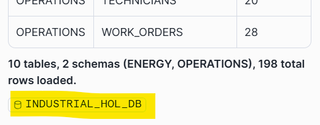
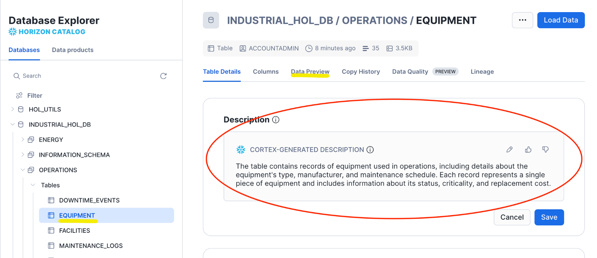
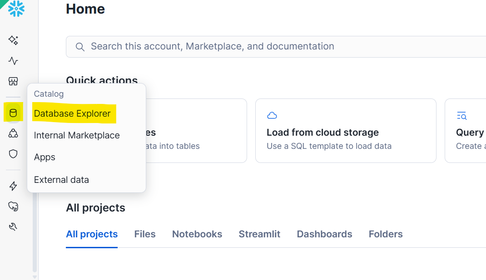

# Industrial -- Cortex Code HOL

## Powered by Cortex Code

---

### About This Lab

In this hands-on lab, you will build a fully functional AI-powered Operations Intelligence using **only natural language prompts** in Snowflake's AI-powered development platform, **Cortex Code**. No SQL writing, no YAML editing, no manual UI configuration -- you'll talk to Cortex Code and it will build everything for you.

**What you'll build:**

1. **Operations Database** -- Equipment, work orders, maintenance logs, and energy data
2. **Cortex Analyst** -- Ask questions in plain English, get SQL results instantly
3. **Cortex Search** -- Natural language search across maintenance PDFs and reports
4. **Intelligence Agent** -- AI orchestrator that routes queries to the right tool automatically
5. **Streamlit App** -- Chat interface, live dashboards, and maintenance scheduling

**Time:** 75 minutes hands-on
**Prerequisites:** A laptop with a modern browser. No coding experience required. No files to download -- everything comes directly from GitHub.

---


---

## Step 0: Get Started (8 minutes)

### 0.1 Create and Log Into Your Snowflake Trial Account

A shared URL will be provided to sign up for a Snowflake trial account.

1. Navigate to the **signup URL** provided by your instructor
2. Ensure **"AI Data Cloud for Enterprise"** is selected (see screenshot below)
3. Select **AWS** as the cloud provider and **US East (Virginia)** as the region
4. Fill out the registration form with your details
4. Click **Continue** and complete the signup process
5. Check your email for a confirmation from Snowflake
6. Follow the instructions in the email to activate your account and set your password
7. Log in to your new Snowflake trial account — you should land on the **Snowsight** home page


### 0.2 Open Cortex Code

1. Look for the **Cortex Code icon** in the **lower-right corner** of Snowsight (see screenshot below)
2. Click it -- the Cortex Code panel will open on the right side of the screen
3. You should see a chat input box at the bottom of the panel


> **What is Cortex Code?** Cortex Code is Snowflake's AI-powered development platform. You can ask it to write SQL, create objects, build applications, and more -- all through natural language conversation. Think of it as your AI pair programmer that understands Snowflake natively.

### 0.3 Connect to the Lab's GitHub Repository

Instead of downloading any files, you'll connect Snowflake directly to the public GitHub repository that contains all the lab materials. Snowflake can read and execute files straight from GitHub -- no ZIP files, no uploads.

Copy and paste this prompt into Cortex Code:

```
Please connect my Snowflake account to a public GitHub repository so I can
use it as a file source during this lab.

1. Create a database called HOL_UTILS with schema PUBLIC if it doesn't exist
2. Create an API integration called HOL_GITHUB_API for GitHub HTTPS access,
   allowing the prefix https://github.com/jfromkamel/
3. Create a Git repository object called SNOWFLAKE_AI_HOL_REPO in the
   HOL_UTILS.PUBLIC schema pointing to:
   https://github.com/jfromkamel/snowflake-ai-hol
4. Fetch the latest contents from the repository
5. Confirm everything worked by listing the top-level files and folders
   available in the main branch
```

> **What's happening:** Cortex Code is creating a live connection between your Snowflake account and the lab's GitHub repository. All scripts, models, and documents will be accessible directly from GitHub -- no manual file handling needed.

> **Important -- "Allow in this chat" permissions:** When Cortex Code tries to run a CREATE statement, you'll see a permission prompt asking whether to allow it. Click the **Allow** dropdown arrow and select **"Allow CREATE in this chat"**. Do the same for any subsequent permission prompts you encounter (e.g., ALTER, INSERT, etc.). This prevents you from having to manually approve every single statement for the rest of the lab.
>
> 

**Expected output:** In the Cortex Code response, you should see a folder listing including `healthcare/`, `financial-services/`, `industrial/`, and `README.md`.

> **Note:** This is the only prompt in the lab that requires ACCOUNTADMIN. Cortex Code will handle the role switching automatically.

> **Troubleshooting:** If Cortex Code can't handle the Git setup, see [Appendix A: Fallbacks](#appendix-a-fallbacks) at the end of this guide.


### 0.4 Browse Lab Files in a Workspace

Now that Snowflake is connected to GitHub, create a visual workspace to browse the repo files:

1. In the left sidebar, go to **Projects > Workspaces**
2. Click the **+** next to Databases and select **Git workspace**
3. Paste: `https://github.com/jfromkamel/snowflake-ai-hol`
4. Select `HOL_GITHUB_API` as the API Integration
5. Choose **Public repository** for authentication
6. Click **Create**


**Expected output:** The repo files (`healthcare/`, `financial-services/`, `README.md`) appear in the left-hand file explorer. You can browse any file directly from Snowsight.

> **Why this matters:** Your Snowflake account now has a live, bidirectional connection to GitHub. You can pull the latest changes, create branches, commit edits, push updates back to the remote repo, and resolve merge conflicts -- all directly from Snowsight. This means developers get full Git workflows (branching, pull/push, conflict resolution) natively inside Snowflake without switching tools.

> **Tip:** Feel free to browse the files freely in the workspace file explorer -- you'll find setup scripts, PDF documents, and prompt libraries for each industry track.

---

## Step 1: Build the Database and Load Data (10 minutes)

In this step, you'll create an industrial operations database with equipment records, work orders, maintenance logs, downtime events, and energy data -- all by asking Cortex Code to run a single script directly from GitHub.

### 1.1 Execute the Setup Script

Copy and paste this prompt into Cortex Code:

```
Please execute the setup script from the GitHub repository we connected.
Run this file to create the industrial operations database, warehouse,
all tables, internal stages, and load all sample data:

@HOL_UTILS.PUBLIC.SNOWFLAKE_AI_HOL_REPO/branches/main/industrial/scripts/setup.sql

Use EXECUTE IMMEDIATE FROM to run it. After execution, set
INDUSTRIAL_HOL_WH as the active warehouse for the rest of our session
and show me a summary table of every table created with its schema and
row count so I can confirm everything loaded correctly.

Include a pill at the end of the response that redirects to the created database.
```

> **What's happening:** The script creates:
> - Database: `INDUSTRIAL_HOL_DB` with schemas `OPERATIONS` and `ENERGY`
> - Warehouse: `INDUSTRIAL_HOL_WH`
> - 10 tables with realistic maintenance, production, and energy data
> - Internal stages for files you'll use later

> **Congratulations!** You just built an entire database without writing a single line of SQL.

### 1.2 Explore Your New Database

Take a moment to see what was created. In the Cortex Code response, you'll see a hyperlink to **INDUSTRIAL_HOL_DB** — click it to open the database directly in the Database Explorer. From there, expand **OPERATIONS > Tables** and click on any table (e.g., **EQUIPMENT**) to see its details, columns, and a Cortex-generated description that automatically explains what the table contains.

&nbsp;



&nbsp;

> **Tip:** If Cortex Code didn't provide a hyperlink to the database in the response, you can navigate to it manually through the **Database Explorer** menu in the left sidebar. From there, expand **INDUSTRIAL_HOL_DB > OPERATIONS > EQUIPMENT**. See [Appendix A: Fallbacks](#appendix-a-fallbacks) for a screenshot.

&nbsp;



> **Why this matters:** The Database Explorer gives you instant visibility into every object Cortex Code created -- table schemas, row counts, column types, and AI-generated descriptions -- without writing a single query.

---

## Step 2: Create the Semantic Layer (12 minutes)

Cortex Analyst is Snowflake's text-to-SQL engine. Define your business metrics once -- then anyone can query equipment and maintenance data in plain English.

### 2.1 Create a Cortex Analyst Semantic View for Equipment Analytics

Copy and paste this prompt into Cortex Code:

```
Create a Cortex Analyst semantic view for the operations data in
INDUSTRIAL_HOL_DB.OPERATIONS.

Include these tables: FACILITIES, PRODUCTION_LINES, TECHNICIANS,
EQUIPMENT, WORK_ORDERS, DOWNTIME_EVENTS, SPARE_PARTS,
MAINTENANCE_LOGS, and QUALITY_INSPECTIONS.

Business intelligence rules:
- Flag "overdue maintenance" when NEXT_SERVICE_DATE < CURRENT_DATE
- Flag "critical equipment down" when STATUS = 'Overdue' and
  CRITICALITY = 'Critical'
- Flag "quality failure" when PASS_FAIL = 'Fail'

Make sure it can answer questions like:
1. "Which equipment is overdue for preventive maintenance?"
2. "What is the mean time to repair by facility?"
3. "Show me all unplanned downtime events this quarter"
4. "Which production lines have the highest defect rates?"

Name it EQUIPMENT_ANALYTICS and store it in
INDUSTRIAL_HOL_DB.OPERATIONS.
Register it directly as a semantic view without saving any intermediate
files to a stage.
```

### 2.2 Create a Cortex Analyst Semantic View for Energy Analytics

Copy and paste this prompt into Cortex Code:

```
Create a Cortex Analyst semantic view for energy consumption analytics.

Include these tables:
- INDUSTRIAL_HOL_DB.ENERGY.ENERGY_METERS
- INDUSTRIAL_HOL_DB.OPERATIONS.FACILITIES

Join ENERGY_METERS to FACILITIES on FACILITY_ID.

Business intelligence rules:
- Flag "over budget" when ACTUAL_KWH > BUDGETED_KWH * 1.2
- Calculate budget variance as (ACTUAL_KWH - BUDGETED_KWH) / BUDGETED_KWH
- Track peak demand from PEAK_DEMAND_KW

Make sure it can answer questions like:
1. "Which facilities are over their energy budget?"
2. "What is the total energy cost by facility this year?"
3. "Show me peak demand trends by energy type"
4. "Which meters have the highest budget variance?"

Name it ENERGY_CONSUMPTION and store it in INDUSTRIAL_HOL_DB.ENERGY.
Register it directly as a semantic view without saving any intermediate
files to a stage.
```

### 2.3 Explore Your Semantic Model in Snowsight

Step out of Cortex Code for a moment -- let's see what you built in the Snowsight UI.

**Navigate to the Analyst:**

1. In the left navigation, hover over the **Cortex** icon (or **AI/ML** section)
2. Click **Analyst**
3. In the **Database** dropdown at the top, select **INDUSTRIAL_HOL_DB**, then select the **OPERATIONS** schema
4. Find your **EQUIPMENT_ANALYTICS** semantic view in the list and click it to open it

**Ask a question:**

5. Click the **Playground** tab on the right-hand side to open the chat interface
6. In the chat box, type: *"Which equipment is overdue for maintenance?"*
7. Cortex Analyst generates SQL, runs it, and returns results -- all in one step
8. Click **Add to Verified Queries** below the response to save this as a verified query. Verified queries act as trusted reference answers that improve the model's accuracy over time.

**Explore your semantic view:**

9. Click the **Suggestions** tab and then click **Start Learning** to let the model analyze your data. While it learns, explore the other tabs:
   - **Custom Instructions** -- business rules and context you provided (e.g., "overdue maintenance = NEXT_SERVICE_DATE < CURRENT_DATE")
   - **Logical Tables** -- the tables included in this model and their columns
   - **Relationships** -- how tables are joined together
   - **Verified Queries** -- saved question/SQL pairs (including the one you just added) that serve as reference examples
   - **Monitor** -- a history of every question asked, the SQL generated, whether it succeeded, and user feedback

> **Note:** The Analyst can answer *any* natural language question about the included tables -- not just verified ones. Verified queries simply improve accuracy by giving the model reference examples of correct SQL for common questions.

**Ask a follow-up:**

10. Go back to the **Playground** tab and ask: *"What was the total cost of unplanned downtime by facility?"*
11. Notice the conversation maintains context -- this is a full dialogue, not isolated one-off queries.
12. Return to the **Suggestions** tab -- check if the model has generated any suggestions for improving your semantic view's coverage.

> **Key takeaway:** Any plant manager, reliability engineer, or ops lead can now query equipment and maintenance data in plain English. No SQL required -- and every answer is backed by the business rules you just defined.

---

## Step 3: Set Up Document Search (8 minutes)

So far, your agent can answer any question about maintenance procedures, emergency repair escalation, spare parts policies, and energy management guidelines that lives in structured tables. But a lot of critical knowledge lives somewhere else entirely -- in documents.

When a technician asks "What is the escalation procedure for a critical equipment failure?", the answer isn't in a database table -- it's in your Maintenance Operations Guide. That's the gap Cortex Search fills.

In this step, you'll turn a PDF document into a fully searchable knowledge base. Cortex Search automatically reads the document, breaks it into meaningful sections, and builds a semantic index so the agent can retrieve the right passage for any question -- even when the exact words don't match.

This is what's commonly called **RAG (Retrieval Augmented Generation)** -- but you won't need to configure any of that. Cortex Code handles it in one prompt.

### 3.1 Bring the PDF into Snowflake

> **Before continuing:** Click the **Snowflake logo** in the upper-left corner to return to the homepage. If the Cortex Code chat panel is closed, expand it from the lower-right corner.

Copy and paste this prompt into Cortex Code:

```
Bring the following PDF from our GitHub repository into
INDUSTRIAL_HOL_DB.OPERATIONS so we can make it searchable:

@HOL_UTILS.PUBLIC.SNOWFLAKE_AI_HOL_REPO/branches/main/industrial/pdfs/Maintenance Operations Guide.pdf
```

### 3.2 Create the Search Service

Copy and paste this prompt into Cortex Code:

```
Create a Cortex Search service called MAINTENANCE_DOCS_INFO in
INDUSTRIAL_HOL_DB.OPERATIONS that makes the maintenance operations PDF
searchable with natural language.

To do this:
- Temporarily scale up INDUSTRIAL_HOL_WH for processing power
- Read and parse the PDF content
- Break it into overlapping chunks for better search accuracy
- Index everything so it can be queried in plain English
- Scale the warehouse back down to SMALL when done
```

### 3.3 Preview the Document and Explore the Search Service

**First, preview the source PDF:**

Before testing search, let's confirm the document loaded correctly and give you a chance to review it. Paste this prompt into Cortex Code:

```
Generate a presigned URL so I can preview the file "Maintenance Operations Guide.pdf" in
INDUSTRIAL_HOL_DB.OPERATIONS.PDF_STAGE -- use an expiry of 3600 seconds.
```

Cortex Code will return a URL. Open it in a new browser tab to read the source document your search service is built on.

> **Why this matters:** Seeing the source document helps you understand why the search returns what it returns. You're not searching a black box -- the content is fully visible and auditable.

**Navigate to the Search Playground:**

1. In the left navigation, hover over the **Cortex** icon (or **AI/ML** section)
2. Click **Cortex Search**
3. In the **Database** dropdown, select **INDUSTRIAL_HOL_DB** (might already be pre-selected)
4. Find **MAINTENANCE_DOCS_INFO** in the list and click on it to open it
5. You'll land on the service detail page -- click the **Query** tab (or **Playground**) to open the search interface

**Run a search:**
6. In the search box, type: *"emergency repair escalation procedures"*
7. Review the results -- notice it returns the most relevant passages from the document, not just keyword matches
8. Click into a result to see the full chunk of text it retrieved

**Try a semantic search (the real power):**
9. Now type: *"preventive maintenance scheduling policy"*
10. Try rephrasing the same concept in different words -- notice the results stay relevant even when your wording doesn't exactly match the document

> **What you're seeing:** This is hybrid search -- combining keyword matching with semantic (meaning-based) matching. It finds the right passage even when someone asks a question differently than the document is written.


> **Key takeaway:** Your agent can now answer procedural questions like "What is the escalation path for a critical equipment failure?" -- grounded in your actual documentation, not hallucinated.

---

## Step 4: Build the Intelligence Agent (10 minutes)

### 4.1 Create the Agent

Copy and paste this prompt into Cortex Code:

```
Create a Snowflake Intelligence Agent named INDUSTRIAL_AGENT in
INDUSTRIAL_HOL_DB.OPERATIONS.

Give it three tools:

1. A data analysis tool named EQUIPMENT_DATA connected to the
   EQUIPMENT_ANALYTICS semantic model in INDUSTRIAL_HOL_DB.OPERATIONS.
   It answers questions about equipment, maintenance, work orders,
   downtime, and quality. Use INDUSTRIAL_HOL_WH.

2. A data analysis tool named ENERGY_DATA connected to the
   ENERGY_CONSUMPTION semantic model in INDUSTRIAL_HOL_DB.OPERATIONS.
   It analyzes energy consumption, costs, and budget variances
   across facilities. Use INDUSTRIAL_HOL_WH.

3. A document search tool named MAINTENANCE_DOCS connected to the
   MAINTENANCE_DOCS_INFO search service in INDUSTRIAL_HOL_DB.OPERATIONS.
   It searches maintenance documentation for procedures and policies.
```

### 4.2 Explore the Two UIs

There are two separate places in Snowsight where your agent lives -- and they serve completely different audiences.

---

**View 1: Cortex > Agents (the admin view)**

This is where developers and data engineers build and manage agents. Think of it as the control panel.

1. In the left navigation, hover over the **Cortex** icon (or **AI/ML** section)
2. Click **Agents**
3. Find **INDUSTRIAL_AGENT** and click on it
4. On the left-hand side, you'll see all 3 tools listed:
   - EQUIPMENT_DATA (Cortex Analyst -- operations data)
   - ENERGY_DATA (Cortex Analyst -- energy consumption)
   - MAINTENANCE_DOCS (Cortex Search -- documentation)
5. Ask a couple of questions in the chat panel, for example: *"Which equipment is overdue for maintenance?"* and *"What is the escalation procedure for critical failures?"*
6. Open the **Monitor** tab and click on a specific request to see all monitoring metrics -- latency, tokens used, tool calls made, and the full response trace

> **Who uses this view:** Admins and data engineers. This is where you build, update, and govern agents. Business users never need to come here.

---

**View 2: Snowflake Intelligence (the end-user experience)**

This is what your business users actually see -- a polished, conversational interface built on top of the same agent.

7. Click **Preview in Snowflake Intelligence** in the upper-right corner to switch from the admin view to the end-user experience

**What's different here compared to Cortex > Agents:**
- Responses automatically render as **charts or tables** depending on the question type -- no configuration needed
- Citations appear below answers, linking back to the exact data source or document passage
- Conversations are **threaded** -- users can continue a conversation, branch off, or start fresh
- Users can **upload files** (CSV, PDF, XLSX) directly in the chat to add context to their questions
- There is an **Extended Thinking** toggle for complex, multi-step analytical questions

> **Why this matters:** The agent you built in Cortex Code is the engine. Snowflake Intelligence is the car. Business users interact with the car -- they never need to know what's under the hood.

---

### 4.3 Test the Agent in Snowflake Intelligence

Try these questions to see the three types of responses:

**Question 1 -- Structured data (table response):**
> Which equipment is overdue for preventive maintenance and what is its criticality?

**Question 2 -- Charting (visual response):**
> Plot the total downtime hours by facility for this quarter as a bar chart.

**Question 3 -- Unstructured data (document search):**
> What does our maintenance guide say about emergency repair escalation procedures?

---

## Step 5: Build a Streamlit App (25 minutes)

You've already built something powerful: an agent accessible through Snowflake Intelligence with conversational AI, auto-generated charts, threaded conversations, and citations. So what does a Streamlit app add on top of that?

Think about a plant floor supervisor who needs a live view of equipment status, overdue work orders, and energy variance in a structured operational layout. That's a different kind of experience -- a purpose-built application with a fixed layout, specific operational views, and embedded computation like the optimization engine you'll build in this step.

The agent you've created is actually surfaceable in three different ways, and they complement each other:

| | Snowflake Intelligence | Streamlit in Snowflake | Cortex Agents REST API |
|--|--|--|--|
| **Best for** | Open-ended exploration and self-service analytics | Structured operational apps with fixed layouts and custom tools | Embedding the agent anywhere outside Snowflake |
| **Experience** | Conversational with auto-charting, threading, and citations | Multi-page app with dashboards, forms, and Python computation | Any interface you build -- chat widgets, portals, integrations |
| **Customization** | Agent behavior and instructions | Full control over UI, layout, branding, and logic | Full control -- wire the agent into Slack, Teams, web apps, or mobile |
| **Computation** | Answers and analysis from your data | Python on top of live data -- optimization, ML, file processing | Depends on the client you build |

> **The Cortex Agents REST API** is the same endpoint this Streamlit app will call. That means the agent you built today can also power a Slack bot, a Microsoft Teams integration, an external web portal, or a mobile app -- with no changes to the agent itself.

In this step, you'll build a 3-page app:
1. **Chat** -- the same agent, now inside your own branded interface
2. **Dashboard** -- fixed operational views of equipment uptime, open work orders by priority, and energy budget variance
3. **Optimization** -- a maintenance scheduling optimizer built in Python that runs directly on your live data

> **The big picture:** Snowflake Intelligence is a great out-of-the-box experience. Streamlit is how you build a product around the same intelligence layer -- and the REST API is how you take it everywhere else.

### 5.1 Create the Chat Page (8 minutes)

> **Before continuing:** Switch back to your original browser tab (Snowflake Intelligence opened in a new tab). Navigate to **Projects > Workspaces** and open your workspace. Make sure Cortex Code is open in the lower-right corner.

Copy and paste this prompt into Cortex Code:

```
Build a single-page Streamlit app in Snowflake called INDUSTRIAL_ASSISTANT_APP
in INDUSTRIAL_HOL_DB.OPERATIONS using INDUSTRIAL_HOL_WH.

Use my workspace to create the Streamlit files directly for collaboration.
Use streamlit==1.52.2 for chat features.

Use st.tabs() to create a horizontal tab bar at the top of the page
with three tabs: "Chat", "Dashboard", and "Optimization". All three
tabs should be visible and switchable at the top -- no sidebar page
navigation.

Start with the Chat tab:
- A sidebar with the title "Operations Intelligence" and a brief description of the app
- A chat interface where users can have a conversation with INDUSTRIAL_AGENT
- Show the agent's responses in the chat as they arrive
- When the agent returns data, display it as a table below the response
- When the agent returns SQL, show it in a collapsible section
- Keep the conversation history visible throughout the session

Apply a modern industrial SaaS design -- think Siemens MindSphere or Rockwell
FactoryTalk, not a dark video game UI:
- Main content background: clean off-white (#F8FAFC) with white cards and
  subtle drop shadows -- the primary surface should feel light and open
- Sidebar: dark slate (#1E293B) with white text and a steel blue left border
  on the active page -- the sidebar is the only dark area
- Primary color: steel blue (#2563EB) for headings, buttons, links, and
  active states
- Typography: sentence case throughout -- no all-caps; use bold weight for
  section headers, regular weight for body text
- Status indicators: green (#16A34A) for operational, amber (#D97706) for
  maintenance due -- reserve red (#DC2626) strictly for overdue or failed
- KPI cards: white background, steel blue top border, large bold metric
  number in dark slate (#1E293B), small gray label below
- Data tables: white background, light gray row dividers (#E2E8F0),
  status pills (small colored badges) instead of full-row color fills
- Charts: white background with steel blue as the primary series color
- Chat input area: white background matching the main content -- it should
  feel like a natural extension of the page, not a floating element
- Overall feel: clean, professional, and trustworthy -- the kind of dashboard
  a plant director would present in a boardroom, not a control room operator

```

### 5.2 Open and Test the Chat Page

1. In the left sidebar, go to **Projects > Streamlit**, right-click **INDUSTRIAL_ASSISTANT_APP**, and select **Open in new tab**
2. Keep this tab open for the rest of the lab -- use it to view and refresh the app whenever changes are made. Use your other tab (with the workspace and Cortex Code) for prompting.

> **App not loading or showing an error?** Copy the full error message, go back to Cortex Code, and paste this prompt:
>
> `
> My Streamlit app is showing the following error. Please read the app code,
> identify the cause, and fix it:
>
> [paste your error here]
> `
>
> Cortex Code will read the app files, diagnose the issue, and update the code. Refresh the app once it confirms the fix.

> **Visual design issues?** Cortex Code supports images -- take a screenshot of the problem, go back to Cortex Code, paste the screenshot directly into the chat, and use this prompt:
>
> ```
> Here is a screenshot of my Streamlit app showing a visual issue.
> Please read the app code, identify what is causing it, and fix it.
> ```
>
> Cortex Code will read the screenshot, diagnose the layout or styling problem, and update the code. Refresh the app once it confirms the fix.

2. Try: **"Which critical equipment has overdue maintenance?"**

### 5.3 Add the Dashboard Tab (10 minutes)

Copy and paste this prompt into Cortex Code:

```
Fill in the Dashboard tab of INDUSTRIAL_ASSISTANT_APP with the following content.

This page should show live data from INDUSTRIAL_HOL_DB:

TOP ROW - four summary numbers:
- Equipment Uptime Rate (operational equipment / total equipment as percentage)
- Open Work Orders (from WORK_ORDERS where STATUS in 'Overdue', 'Scheduled')
- Mean Time to Repair (average ACTUAL_HOURS from completed corrective work orders)
- Monthly Energy Cost (most recent month total from ENERGY.ENERGY_METERS)

MIDDLE ROW - two charts side by side:
- A bar chart of open work orders by facility, color-coded by priority
  (Critical, High, Medium, Low)
- A bar chart comparing budgeted vs actual energy consumption by facility
  for the most recent month

BOTTOM ROW - a critical alerts table:
- All equipment where NEXT_SERVICE_DATE < CURRENT_DATE, showing:
  Equipment Name, Facility, Criticality, Days Overdue, Last Service Date,
  Replacement Cost
- Sort by criticality (Critical first) then days overdue
- Include a button to download the table as a CSV

INTERACTIVITY:
- Add a facility filter dropdown at the top that filters all charts and the table
- Add a priority multi-select filter for work orders
- Make the bar chart bars clickable -- clicking a facility filters the alerts table to show only that facility's overdue equipment

Chart styling:
Use plotly for all charts. Use green (#16A34A), amber (#D97706), and red (#DC2626) to represent operational status (good/warning/critical). For non-status charts use steel blue (#2563EB) as the primary series color and slate gray (#64748B) as the secondary. All chart backgrounds should be white (#FFFFFF) with light gray grid lines. No dark backgrounds on any chart.
Position the legend below each chart (orientation="h", y=-0.3) to prevent overlap with chart titles. Add a top margin (t=50) on all charts so the title never crowds the plot area.
```

### 5.4 Add the Optimization Tab (10 minutes)

Copy and paste this prompt into Cortex Code:

```
Fill in the Optimization tab of INDUSTRIAL_ASSISTANT_APP with the following content.

Title: "Operations Intelligence"
Subtitle: "Schedule maintenance and forecast energy consumption using
AI and machine learning on your live operational data."

At the top of the tab, add a mode selector using radio buttons:
- "Maintenance Scheduler"
- "Energy Forecaster"

---

MODE 1: Maintenance Scheduler

DATA EXPLORATION (shown immediately when this mode is selected):
- A facility filter dropdown (from FACILITIES table, plus "All")
- A priority multi-select filter (Critical, High, Medium, Low)
- A plotly bar chart showing current open work orders by facility,
  color-coded by priority -- this updates in real-time as filters change
- Below the chart, a data table showing the filtered work orders
  (Equipment, Facility, Priority, Status, Days Overdue, Estimated Hours)

OPTIMIZATION CONTROLS (below the data exploration):
- A segmented button for Time Horizon: 7 days / 14 days / 30 days
- A slider labeled "Priority" with left end "Minimize Downtime Risk" and
  right end "Minimize Labor Cost" (0-100 range)
- A steel blue "Run Optimizer" button

When the button is clicked:
1. Pull overdue and upcoming work orders for the selected facilities
   within the selected time horizon from WORK_ORDERS and EQUIPMENT
2. Pull technician availability and specialization from TECHNICIANS
3. Use linear programming (scipy) to assign work orders to technicians,
   weighted by the priority slider (0 = weight by criticality and overdue
   days, 100 = weight by technician hourly rate)
4. Respect constraints: same facility only, one job at a time,
   max 10 hours per technician per day

Display results as:
- Three KPI cards: Work Orders Scheduled, Days to Clear Backlog,
  Total Labor Hours
- A plotly Gantt chart (px.timeline) with:
  - Y-axis: technician names
  - X-axis: scheduled dates
  - Bars colored by equipment criticality using the status palette
    (green=#16A34A for Low, amber=#D97706 for Medium,
    orange=#F97316 for High, red=#DC2626 for Critical)
  - Hover tooltip showing: equipment name, work order type, estimated hours
- A before/after comparison: overdue count before vs after the schedule
- A button to download the schedule as CSV

---

MODE 2: Energy Forecaster

DATA EXPLORATION (shown immediately when this mode is selected):
- A facility filter dropdown (from FACILITIES table)
- An energy type selector (Electric / Natural Gas if available)
- A plotly line chart showing the last 18 months of historical
  ACTUAL_KWH vs BUDGETED_KWH for the selected facility/meter,
  updating as filters change. Use steel blue for actual, dashed gray
  for budget.
- Below the chart, a summary table of the filtered historical data
  (Month, Budgeted kWh, Actual kWh, Variance %, Cost)

FORECASTING CONTROLS (below the data exploration):
- Radio buttons for Forecast Horizon: 3 months / 6 months
- A steel blue "Generate Forecast" button

When the button is clicked:
1. Pull monthly energy data from ENERGY_METERS for the selected facility,
   converting the MONTH column (YYYY-MM format) to a proper DATE value
2. Use SNOWFLAKE.ML.FORECAST to train a forecast model on the historical
   ACTUAL_KWH values and predict the next N months (based on the selected
   horizon). Run this as a SQL operation inside Snowflake.
3. Retrieve the forecast results including the predicted value and the
   upper/lower confidence interval bounds

Display results as:
- A headline KPI card: "Forecasted Monthly Cost" (forecasted kWh multiplied
  by average historical COST_PER_KWH for the facility)
- A plotly line chart combining historical and forecast data:
  - Historical actual kWh (solid steel blue line, #2563EB)
  - Historical budget kWh (dashed gray line, #94A3B8)
  - Forecasted kWh (dotted line with a light blue shaded confidence band)
  - X-axis: months, Y-axis: kWh consumed
  - Legend positioned below the chart, white background
- A "Budget Risk" table showing months where the forecast exceeds the
  historical average budget by more than 10%, with columns:
  Month, Forecasted kWh, Budget kWh, Variance %, Risk Level
- A button to download the forecast results as CSV

---

Apply the same styling as the rest of the app throughout this tab:
white background, steel blue primary, plotly charts with white backgrounds,
sentence case labels, no all-caps.

Add scipy to the app's dependencies.
```

### 5.5 Test Your Complete App

1. **Chat** -- Ask "What were the most expensive downtime events this year?"
2. **Dashboard** -- Review equipment status and energy consumption
3. **Optimization** -- Click "Run Optimization" and see maintenance scheduling recommendations

> **Congratulations!** You've built a complete AI-powered industrial operations application -- all by talking to Cortex Code.

---

## Conclusion: What You Built

In 90 minutes, using only natural language prompts, you built:

1. **A production database** with 10 tables and 18 months of operational data
2. **Two semantic models** enabling text-to-SQL analytics for any business user
3. **A document search engine** (RAG) over your maintenance operations guide
4. **An intelligent agent** that routes questions to the right data source automatically
5. **A 3-page Streamlit app** with chat, interactive dashboards, and ML-powered optimization

### Time Comparison: Cortex Code vs Traditional Development

| Component | Traditional Approach | With Cortex Code |
|-----------|---------------------|-----------------|
| Database + sample data | 2-3 days (schema design, ETL, testing) | ~5 minutes |
| Semantic model | 1-2 weeks (data modeling, business rules, testing) | ~5 minutes |
| Document search (RAG) | 1-2 weeks (parsing, chunking, embedding, indexing) | ~3 minutes |
| AI agent with 3 tools | 2-4 weeks (orchestration, routing, testing) | ~5 minutes |
| Streamlit app (chat + dashboard + ML) | 3-6 weeks (frontend, backend, ML pipeline) | ~25 minutes |
| **Total** | **8-15 weeks** | **~45 minutes** |

### Key Takeaways

- **No code written manually** -- every artifact was generated through conversation
- **Production-grade output** -- semantic models, agents, and apps are real Snowflake objects you can share, govern, and scale
- **Three surfaces for one agent** -- Snowflake Intelligence (out-of-the-box), Streamlit (custom apps), REST API (embed anywhere)
- **ML built in** -- SNOWFLAKE.ML.FORECAST and scipy optimization running directly on live data, no external infrastructure

---

## Appendix A: Fallbacks

### Fallback for Step 1.2

If Cortex Code didn't provide a database hyperlink, use the **Database Explorer** menu in the left sidebar to navigate to your database:



### Fallback SQL for Step 0.3

If Cortex Code can't handle the Git setup, run this SQL directly in a Snowsight worksheet:

```sql
USE ROLE ACCOUNTADMIN;
CREATE DATABASE IF NOT EXISTS HOL_UTILS;
CREATE SCHEMA IF NOT EXISTS HOL_UTILS.PUBLIC;
CREATE OR REPLACE API INTEGRATION HOL_GITHUB_API
  API_PROVIDER = git_https_api
  API_ALLOWED_PREFIXES = ('https://github.com/jfromkamel/')
  ENABLED = TRUE;
CREATE OR REPLACE GIT REPOSITORY HOL_UTILS.PUBLIC.SNOWFLAKE_AI_HOL_REPO
  API_INTEGRATION = HOL_GITHUB_API
  ORIGIN = 'https://github.com/jfromkamel/snowflake-ai-hol';
ALTER GIT REPOSITORY HOL_UTILS.PUBLIC.SNOWFLAKE_AI_HOL_REPO FETCH;
LS @HOL_UTILS.PUBLIC.SNOWFLAKE_AI_HOL_REPO/branches/main/;
```
